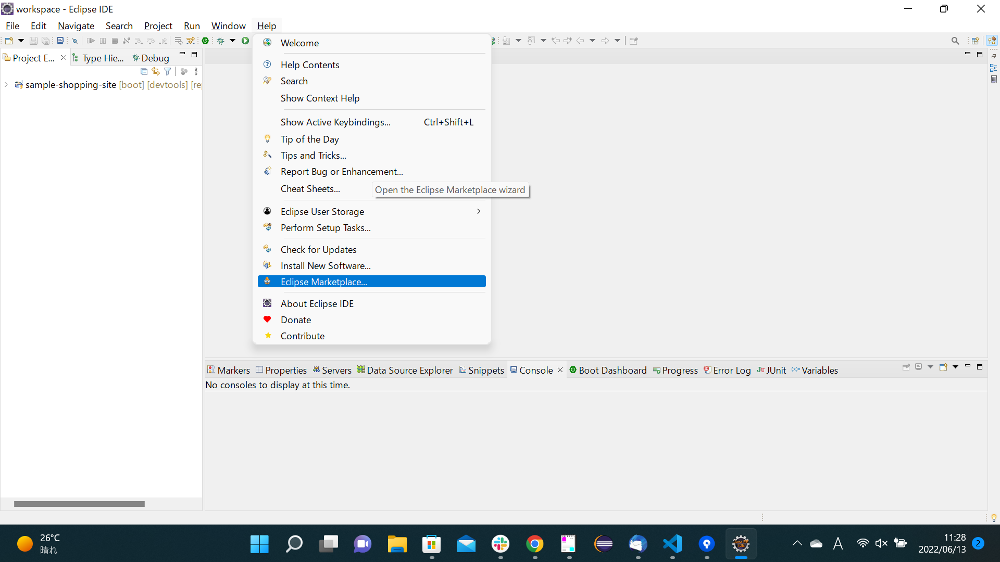
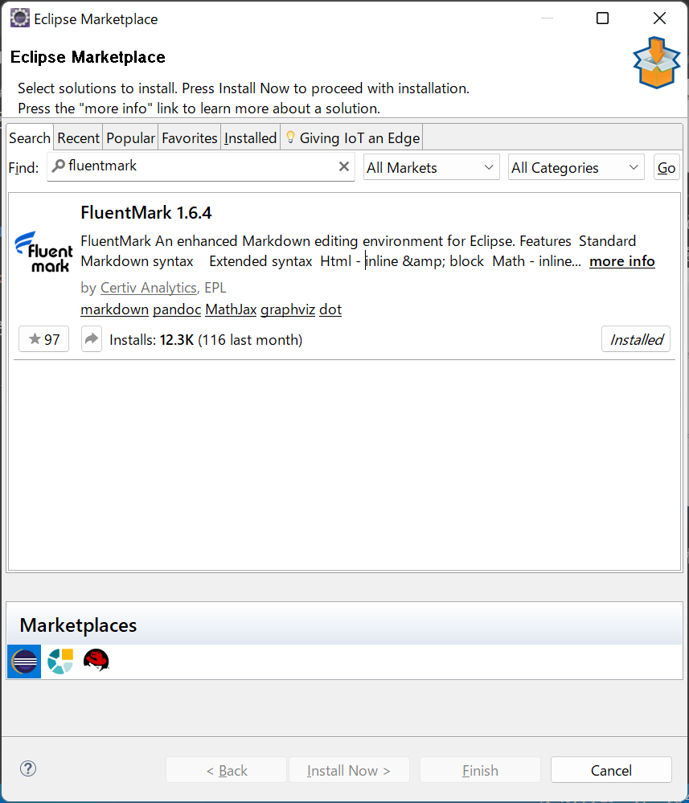
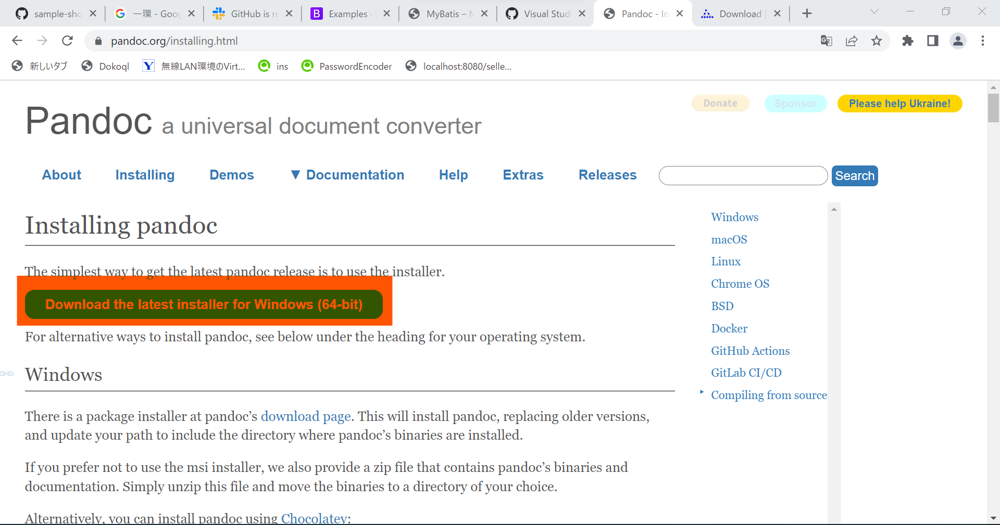
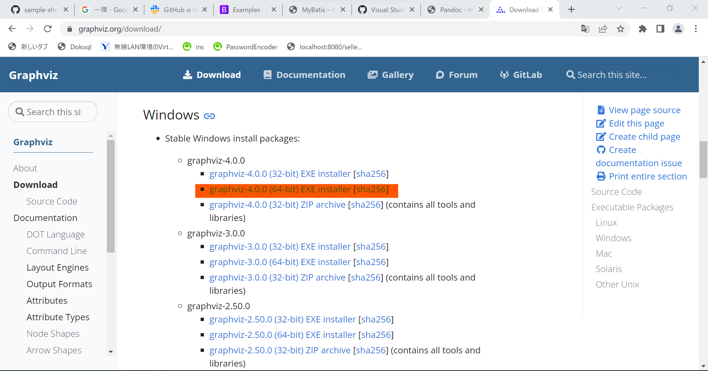
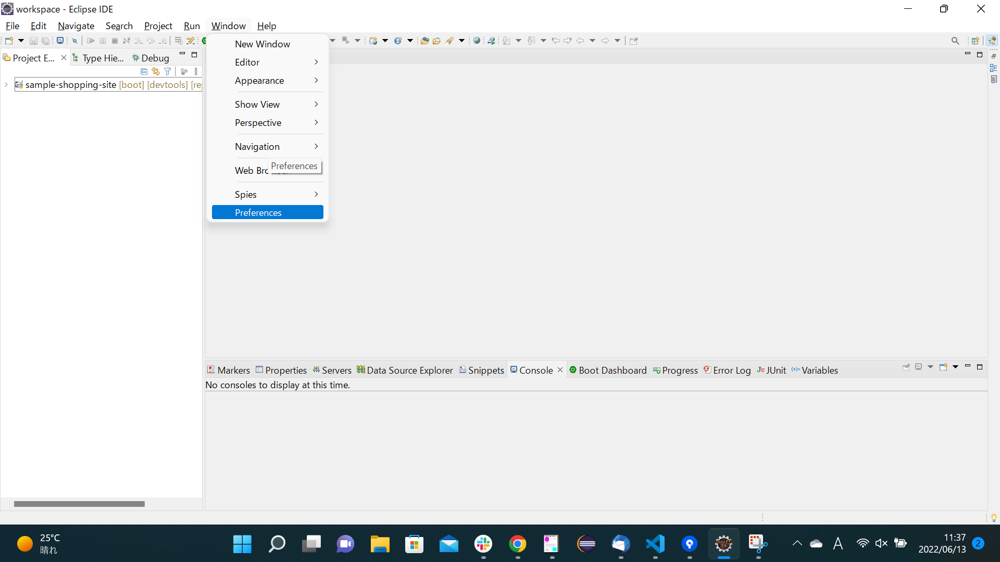
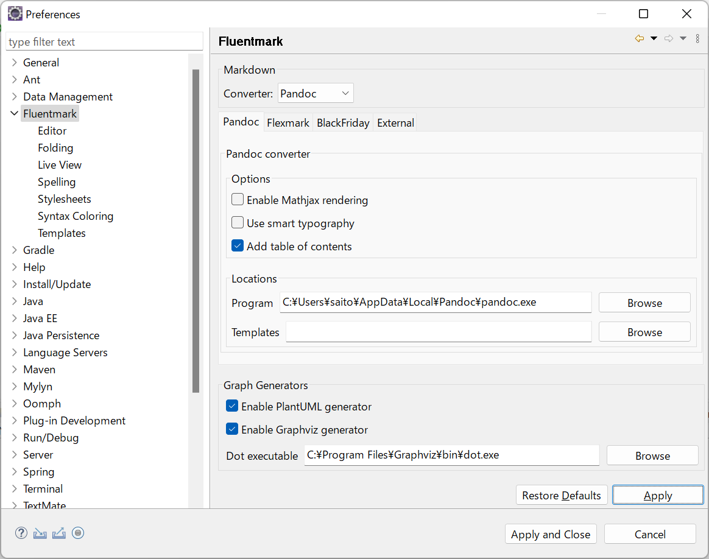
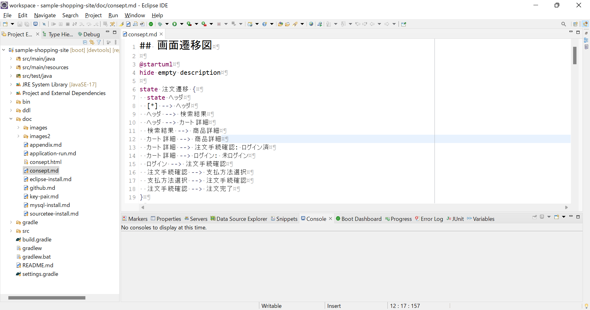
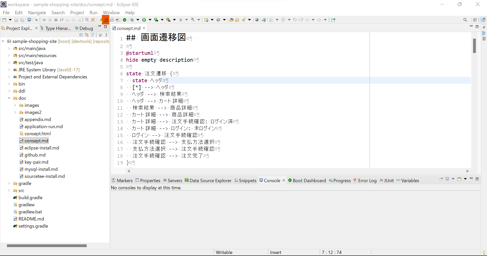
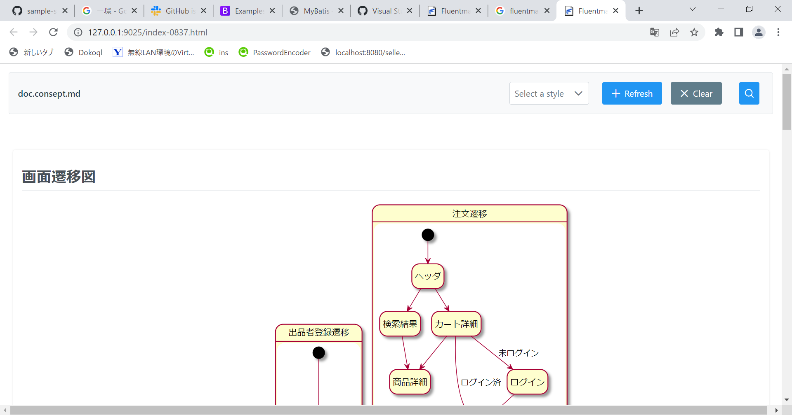

# Appendix

### 目次

+ [application.propertiesを開いたときにエラーが発生した場合の対処](#application.propertiesを開いたときにエラーが発生した場合の対処)

+ [EclipseでMarkdown、UMLを書くための準備](#EclipseでMarkdown、UMLを書くための準備)

---

### application.propertiesを開いたときにエラーが発生した場合の対処

  

上のようにapplication.propertiesを開いたときにエラーが発生した場合、以下のリンクを参考にして対応が可能です。

[https
://github.com/spring-projects/sts4/issues/775](https://github.com/spring-projects/sts4/issues/775)

1. メニューバーから`Help` -> `Install New Software`をクリック。 
  

1. Addボタンをクリック。
  

1. Nameは任意。Locationに`http://download.eclipse.org/tm4e/snapshots/`を入力して、Addをクリック。
  

1. `TextMate`->`Text Mate Core`にチェックを入れてNextをクリック。
  

1. Nextをクリック。
  

1. ラジオボタンをチェックして、Finishをクリック。
  

1. Eclipseを再起動して、application.propertiesが開けるかどうか確認。
  

---

### EclipseでMarkdown、UMLを書くための準備

1. `Help`->`Eclipse Marketplace`をクリック。
  

1. 検索バーに`fluentmark`を入力して検索。FluentMarkをインストールする。
  

1. [Pandoc](https://pandoc.org/installing.html)をインストールする。
  

1. [Graphviz](https://graphviz.org/download/)をインストールする。
  

1. `Window`->`Preferences`からEclipseの設定画面を開く。 
  

1. 以下の通り、Fluentmarkの設定を行います。
+ 左側のリストから`Fluentmark`を選択。
+ `Markdown`->`Converter`はPandocを選択。
+ `Add table of contents`をチェック。
+ `Locations`->`Program`にpandoc.exeのファイルパスを入力。
+ `Enable PlantUML Generator`をチェック。
+ `Enable Graphviz Generator`をチェック。
+ `Dot executable`にdot.exeのファイルパスを入力。
  

1. 試しにMarkdownで記載されたmdファイルを変換した状態で確認。`Project Explorer`から`/sample-shopping-site/doc/consept.md`を開く。
  

1. Eclipse上部のツールバーの、`Open FluentMark Viewer`のアイコンをクリック。
  

1. ブラウザでスタイリングされた文章やUMLが確認できるようになりました。
  

