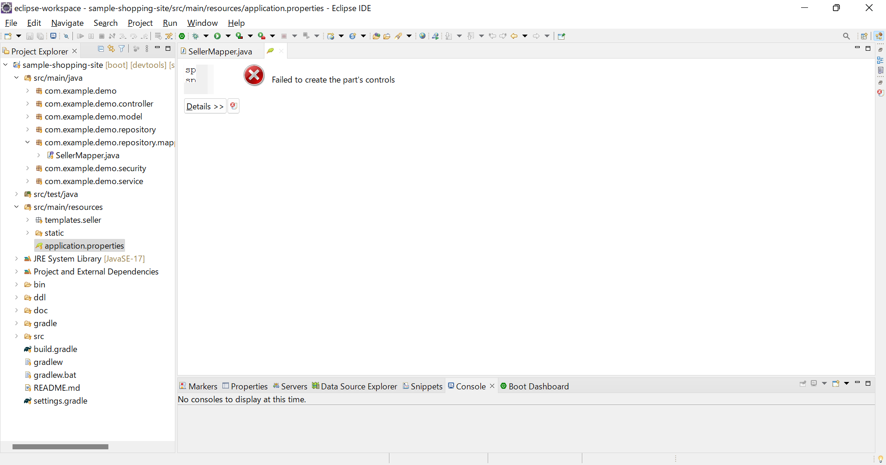

# Appendix

### 目次

+ [application.propertiesを開いたときにエラーが発生したときの対処](#application.propertiesを開いたときにエラーが発生したときの対処)

---

### application.propertiesを開いたときにエラーが発生したときの対処

  

上のようにapplication.propertiesを開いたときにエラーが発生した場合、以下のリンクを参考にして対応が可能です。

[https
://github.com/spring-projects/sts4/issues/775](https://github.com/spring-projects/sts4/issues/775)

1. メニューバーから`Help` -> `Install New Software`をクリック。 
  

1. Addボタンをクリック。
  

1. Nameは任意。Locationに`http://download.eclipse.org/tm4e/snapshots/`を入力して、Addをクリック。
  

1. `TextMate`->`Text Mate Core`にチェックを入れてNextをクリック。
  

1. Nextをクリック。
  

1. ラジオボタンをチェックして、Finishをクリック。
  

1. Eclipseを再起動して、application.propertiesが開けるかどうか確認。
  

