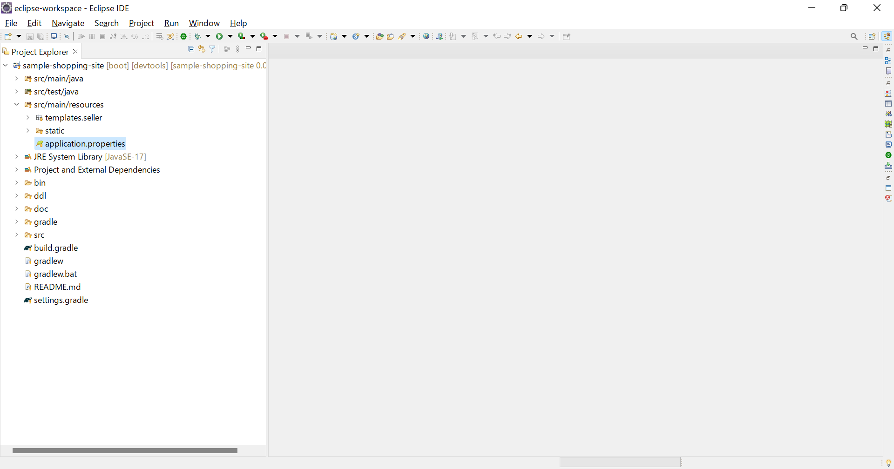
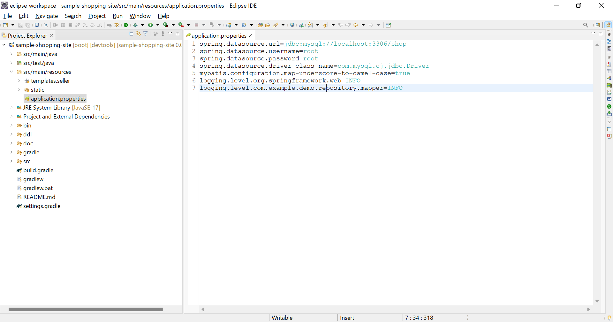
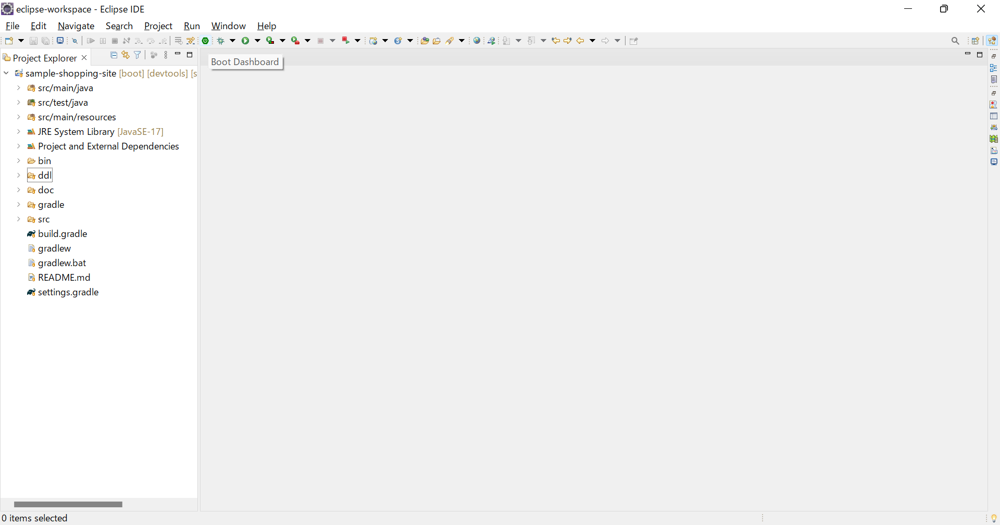
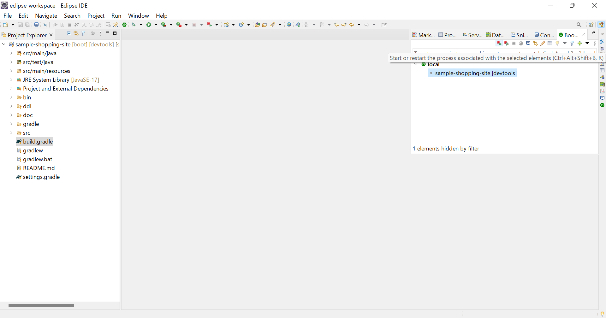
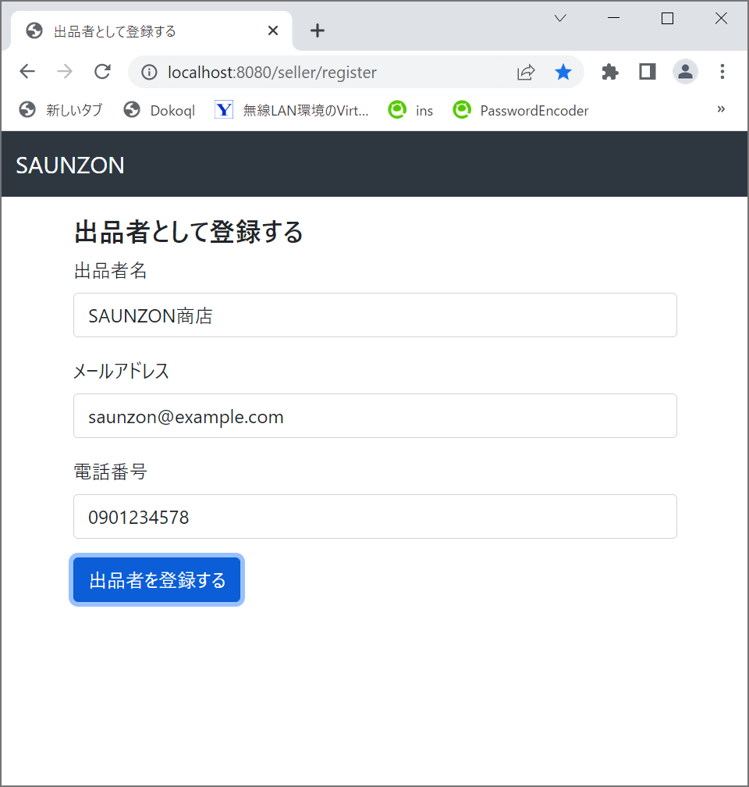
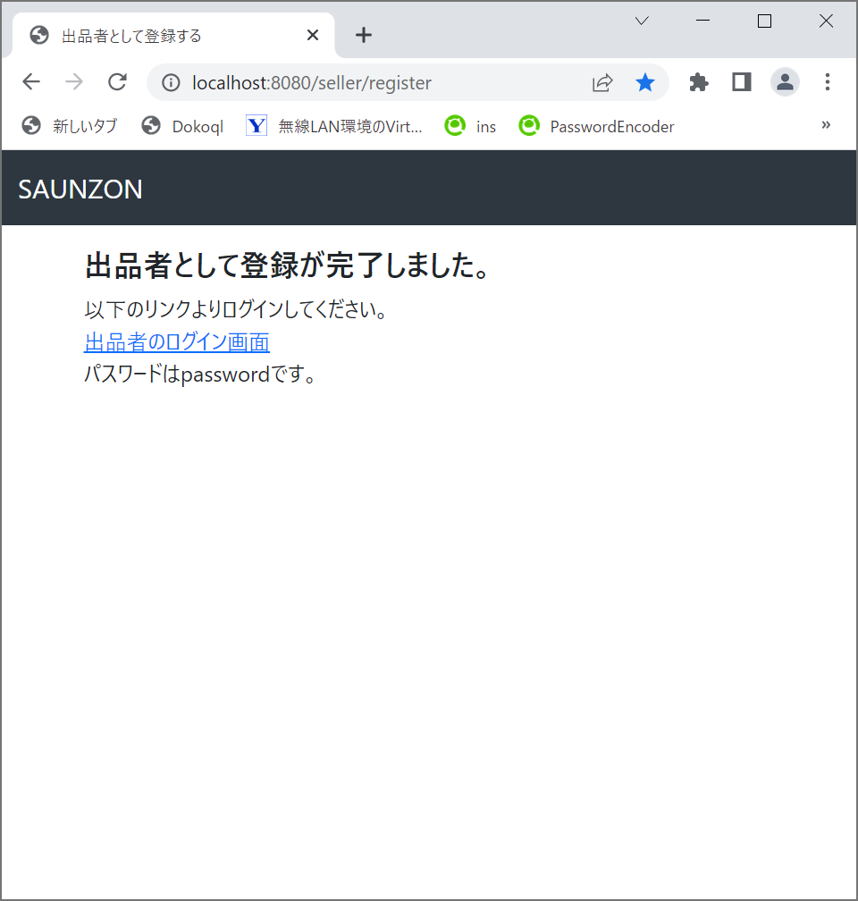

# アプリの動作確認

1. `Project Explorer`から`application.properties`を開きます。（もしエラーで開けなかった場合[Appendix](./appendix.md)を参照）
  

1. `spring.datasource.password`にMySQL環境構築時に設定したパスワードを入力し保存。
  

1. 画面上部のBoot Dashboardのアイコンをクリック。
  

1. sample-shopping-siteを選択して起動アイコンをクリック。
  

1. Consoleに`Started SampleShoppingSiteApplication`が出ていたらアプリ起動成功。

1. [http://localhost:8080/seller/register](http://localhost:8080/seller/register)にアクセスして画面表示を確認。
  

1. 試しに登録してみます。
  

1. 登録ができました。
  

動作確認は以上です。