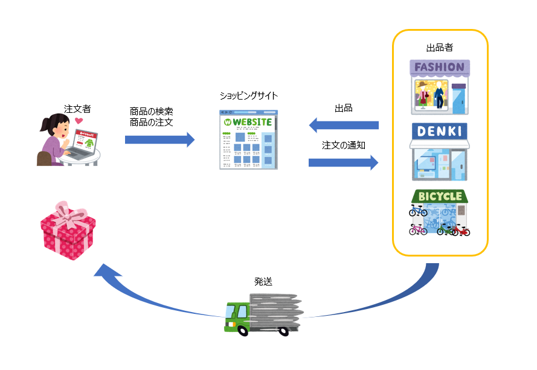

# 目次
+ [ショッピングサイトのイメージ](#ショッピングサイトのイメージ)
+ [画面遷移図](#画面遷移図)
+ [概念モデル図](#概念モデル図)
+ [概念モデル説明](#概念モデル説明)
+ [進め方ヒント](#進め方ヒント)

# ショッピングサイトのイメージ

  

+ 出品者にとってはWEBサイト上で売りたい商品を公開・管理することができる。  
ショッピングサイトを通じて注文を受け取り、発送が行えるようなサイトを目指す。
+ 注文者にとっては出品された商品を検索でき、様々な支払方法で商品の注文が行えるサイトを目指す。

# 画面遷移図

@startuml
hide empty description

state 注文遷移 {
  state ヘッダ
  note right of ヘッダ : ・商品検索用の入力バー\n・カート詳細へ遷移するためのボタンがある。
  [*] --> ヘッダ
  ヘッダ --> 検索結果: 商品を検索する
  ヘッダ --> カート詳細: カートの中身を確認する
  検索結果 --> 商品詳細
  カート詳細 --> 商品詳細
  カート詳細 --> 注文手続確認: ログイン済
  カート詳細 --> ログイン: 未ログイン
  ログイン --> 注文手続確認
  注文手続確認 --> 支払方法選択
  支払方法選択 --> 注文手続確認
  注文手続確認 --> 注文完了: 注文を確定する
}

state 出品者遷移 {
  [*] --> 出品者ログイン
  出品者ログイン --> 注文一覧
  注文一覧 --> 注文詳細
  出品者ヘッダ --> 注文一覧
  出品者ヘッダ --> 出品者ログイン: ログアウト
  出品者ヘッダ --> 商品一覧
  商品一覧 --> 商品追加
  商品追加 --> 商品一覧
  商品一覧 --> 出品者商品詳細
  出品者商品詳細 --> 商品変更
  商品変更 --> 出品者商品詳細
  出品者商品詳細 --> 商品削除確認
  商品削除確認 --> 商品一覧
}

state 出品者登録遷移 {
  [*] --> 出品者登録
  出品者登録 --> 出品者登録完了
  出品者登録完了 -left-> 出品者ログイン
}
@enduml

# 概念モデル図

@startuml

hide circle
hide method

class 出品者 {
  出品者ID
  メールアドレス
  出品者名
  電話番号
  パスワード
}
class 商品 {
  出品者ID
  商品ID
  商品名
  価格（税込）
}
class 注文者 {
  注文者ID
  メールアドレス
  注文者名
  住所
}
class カート {
  注文者ID
}
class カート商品 {
  商品ID
  個数
}
class 注文 {
  注文ID
  注文日
  注文者ID
  注文商品リスト
}
class 注文商品 {
  注文ID
  商品ID
  個数
}
class 支払手続 {
  注文ID
  支払手続日
  支払方法ID
  支払手続結果
}
class 支払方法 {
  支払方法ID
  支払方法名
}
class 発送 {
  発送ID
  注文ID
  商品ID
  発送日
  発送方法ID
}
class 発送方法 {
  発送方法ID
  発送方法名
}

出品者 -- 商品
注文者 -- 注文
注文 -left- 注文商品
商品 -- 注文商品
注文 -- 発送
注文 -right- 支払手続
カート -left- 注文者
カート -right- 注文
カート -up- カート商品
支払手続 -- 支払方法
発送 -left- 発送方法
@enduml

# 概念モデル説明

### 出品者

+ ショッピングサイトに商品を出品(追加)や価格の変更等、商品を管理することができる。
+ 出品者となるには出品者登録をする必要がある。
+ 出品者はメールアドレスを元に識別し、重複登録は認めない。
+ 出品者は他出品者の商品を管理できないよう、アカウントの識別を行う。

### 商品

+ 商品の出品は出品者のみが行える。
+ 出品者は商品の追加、変更、削除をすることができる。
+ 出品者は他の出品者として商品を出品することはできない。また他の出品者が追加した商品の変更、削除することはできない。
+ 商品の管理は出品者専用画面から行う。出品者専用画面へは出品者のログイン画面から認証することで遷移することができる。

### 注文者

+ 注文者は商品を注文することができる。
+ 注文者は商品を注文するとき、事前に注文者登録をする必要がある。
+ ただし商品の検索、閲覧は注文者登録前であっても可能とする。

### 注文

+ 注文者が出品者に対して商品の発送を依頼すること。
+ 注文するためには、注文者はカートに商品を入れておく必要がある。
+ 注文を完了するためには、注文者は支払手続きを完了させる必要がある。
+ 注文が完了した場合、注文者と出品者の両方にメールを送信する。

### カート

+ 注文するためには商品をカートに入れる必要がある。
+ カートは注文者が個々に管理し、カートへの商品追加、カート内の商品削除が自由に行える。
+ 一定時間放置されたカート内の商品は解放され、カートの中身は空になる。
+ カート内の商品は画面遷移に伴い削除されることはない。

### 注文商品

+ 注文者が注文した商品。
+ 出品者、注文者は注文した商品の履歴を閲覧することができる。

### 支払手続

+ 注文者が注文の際に行う。
+ 注文者は様々な支払方法をショッピングサイト上で選択し、支払を行うことができる。

### 発送

+ 注文をもとに出品者は商品を発送する。
+ 発送は支払手続きが完了している必要がある。
+ 発送が完了した場合、注文者にメールを送信する。

# 進め方ヒント

+ 出品者登録、出品者ログインは事前に実装済です。
+ 以下の順番で実装すると進め易いと思われます。
  1. 出品者の商品追加、変更、削除
  1. 注文者の商品検索、カート
  1. 注文者ログイン
  1. 注文
  1. 出品者の注文一覧、詳細