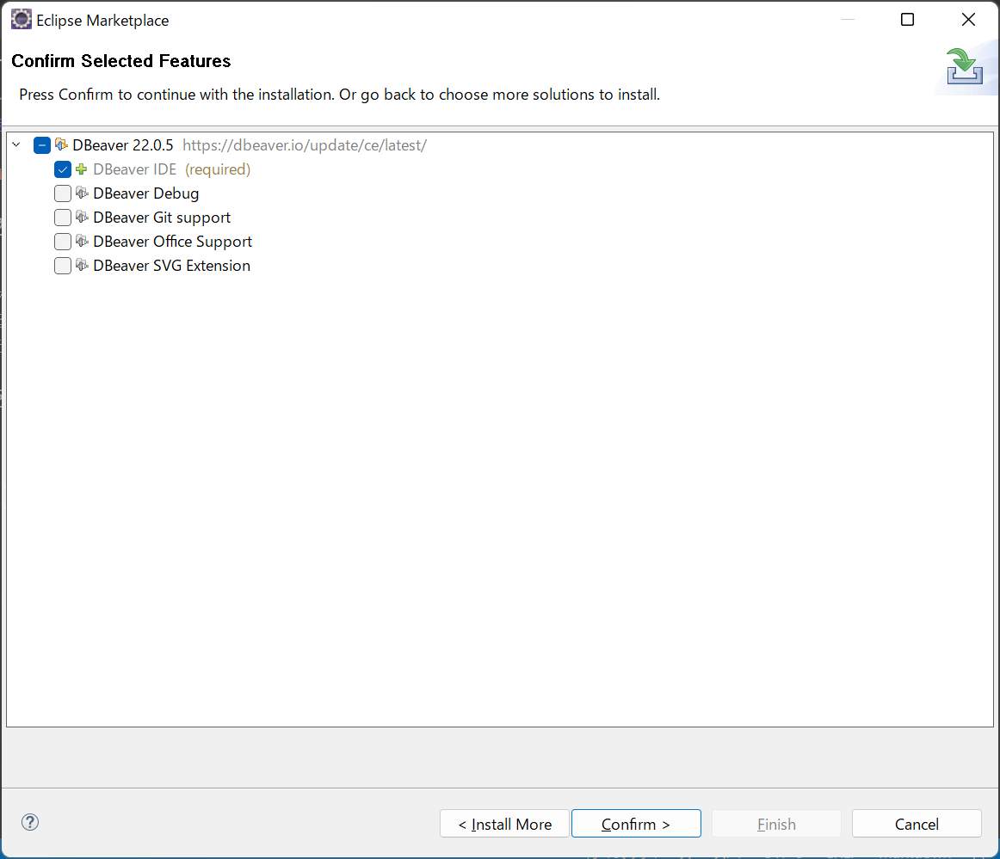
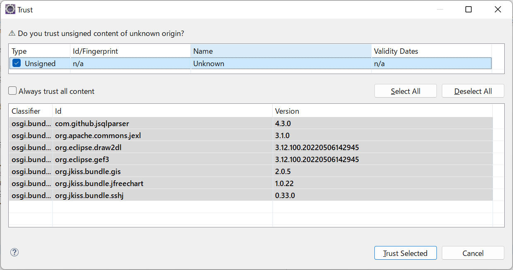
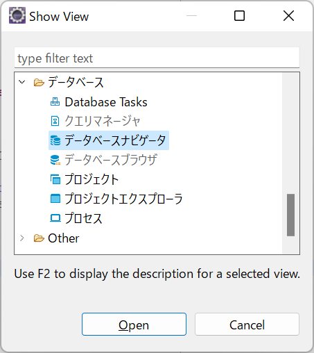

# DBeaverのインストール手順

1. Eclipseから`Eclipse Marketplace`を開く。  
  

1. 検索バーで`dbeaver`と検索。 いくつかDBeaverと記載のあるプラグインが出てくるが、`DBeaver {version}`と記載があるものの`install`をクリック。  
  

1. `Confirm`をクリック。  
  

1. このウィンドウが表示されたら、`Unsigned`にチェックして、`Trust Selected`をクリック。  
  

1. Eclipseの再起動を求められたら再起動。  

1. 再起動できたら上部メニューバーから`Window`->`Show View`->`Other`をクリック。  
  

1. データベースナビゲータをクリック。  
  

1. データベースナビゲータの右上の新しい接続をクリック。  
  

1. MySQLのロゴを選択して`Next`をクリック。  
  

1. `Database`と`パスワード`を入力して、`テスト接続`をクリック。  
  

1. 接続できることを確認。
(`ここでMySQLドライバがみつかりません`と記載されたウィンドウが表示されたら、そのウィンドウのダウンロードボタンをクリック。)  
  

1. Finishをクリック。  
  

1. データベースナビゲータからテーブルを選択してみます。  
  

1. 対象のテーブルにアクセスできることを確認。  
  

1. 右上の検索アイコンをクリックすると検索バーが表示。`SQLエディタ`を入力して、`SQLエディタを開く`をクリック。
<strong>※他にSQLエディタを開く方法が見つからなかった。良い方法見つけたらIssueで連絡いただきたいです。</strong>

  

1. SQLエディタが開いたら`select * from sellers;`を入力して`Ctrl + Enter`または左側のSQLの実行アイコンをクリック。  
  

1. SQLが実行できたことを確認。  
  

以上。