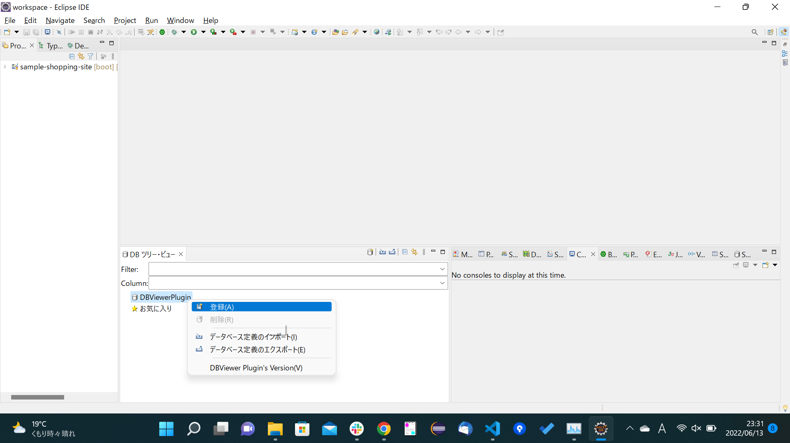

# DBViewerのインストールと設定

1. メニューバーより`Help`->`Eclipse Marketplaces`をクリック。
  

1. 検索バーにdbViewerを入力して検索。DBViewerのInstallをクリック。
  

1. この画面が出た場合は、UnsignedにチェックしてTrast Selectedをクリック。
  

1. 再起動を求められるので再起動。
  

1. 再起動したらメニューバーの`Window`->`Show View`->`Other`をクリック。
 

1. DBツリー・ビューを選択して、Openをクリック。
  

1. DBViewerPluginを右クリックして、登録をクリック。
  

1. ファイル追加をクリック。
  

1. 以下のファイルを選択して、開くをクリック。
`C:\Program Files (x86)\MySQL\Connector J 8.0\mysql-connector-java-8.0.29.jar`
  

1. データベース名は任意入力でNextをクリック。
  

1. JDBC Driverで`com.mysql.jdbc.Driver`を選択。
  

1. JDBC Driverを選択すると自動でテンプレートが入力される。
  

1. 以下の通り入力して、テスト接続をクリック。ウィンドウ上部に`接続に成功しました`が表示されることを確認して、Nextをクリック。

    | 項目名 | 入力値 |
    | --- | --- |
    | 接続文字列 | jdbc:mysql://localhost:3306/shop |
    | 接続ユーザ | root | 
    | 接続パスワード | MySQL環境構築時に設定したパスワード |
    
      

1. Finishをクリック。
  

1. 追加したDB定義で右クリックして、接続をクリック。
  

1. `shop`->`TABLE`->`sellers`をクリックして、テーブルの内容が確認できること。
  

1. メニューバーの`Window`->`Show View`->`Other`をクリック。
 

1. `DBViewer Plugin`->`SQL実行・ビュー`を選択して、Openをクリック。

1. `SQL 実行ビュー`のビューが表示。`select * from sellers;`を入力して`Shift + Enter`でSQLを実行。
  

1. SQLの実行結果が表示されることを確認。
  
