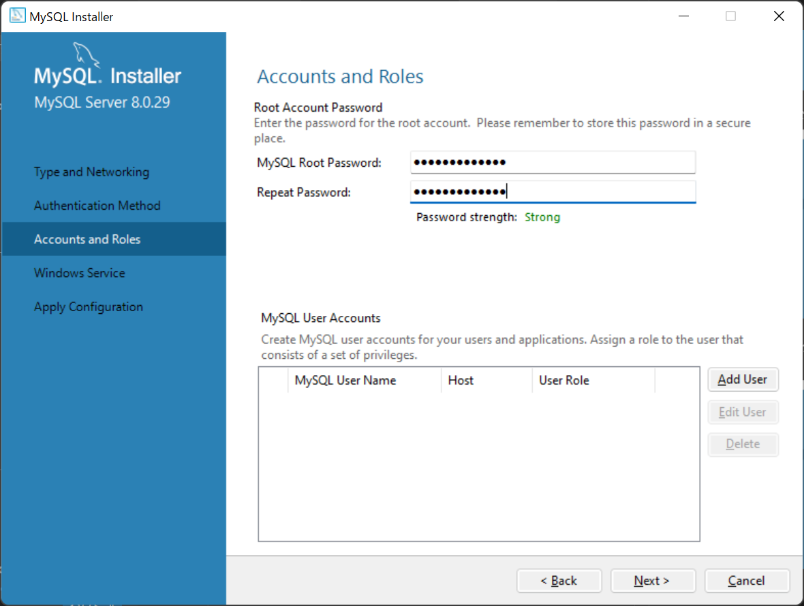

# MySQLのインストールと準備手順

1. [https://www.mysql.com/jp/downloads/](https://www.mysql.com/jp/downloads/)にアクセスする。

1. ページ下部の`MySQL Community (GPL) Downloads »`をクリック。
  

1. `MySQL Installer for Windows`をクリック。
  

1. ダウンロードサイズが少ない上のDownloadボタンをクリック。
  

1. 下部の`No thanks, just start my download.`をクリック。ダウンロードが完了したらインストーラを起動。
  

1.  `Developer Default`を選択してNextをクリック。
  

1. Nextをクリック。
  

1. Nextをクリック。 

1. Executeをクリック。
  

1. ダウンロードが完了したらNextをクリック。
  

1. Executeをクリック。インストールが完了したらNextをクリック。
  

1. Nextをクリック。
  

1. Nextをクリック。
  

1. Nextをクリック。
  

1. パスワードを入力して、Nextをクリック。
  

1. Nextをクリック。
  

1. Executeをクリック。
  

1. Finishをクリック。
  

1. Nextをクリック。
  

1. Finishをクリック。

1. Nextをクリック。
  

1. パスワードを入力してCheckをクリック。チェックが成功したらNextをクリック。
  

1. Executeをクリック。
  

1. Finishをクリック。
  

1. Nextをクリック。
  

1. Finishをクリック。
  

1.  MySQL Workbenchが自動的に開くので、左下のLocal Instanceをクリック。
  

1. パスワードを入力してOKをクリック。
  

1. [ddl.sql](../ddl/ddl.sql)のSQLをMySQL Workbench中央のQuery 1に貼り付けて、上から順番にSQLを実行。赤枠のアイコンでキーボードカーソル上のSQLが実行できる。
  

ここまででMySQL構築手順が完了です。