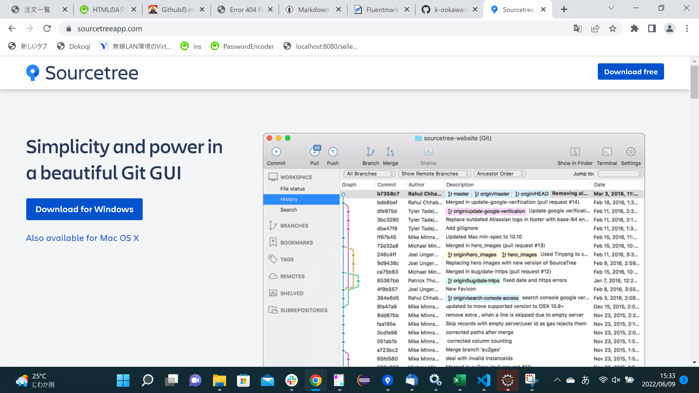
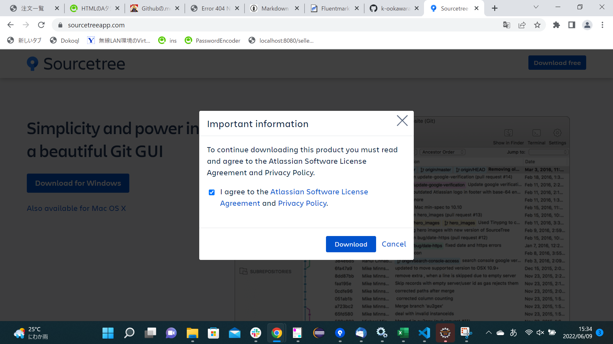
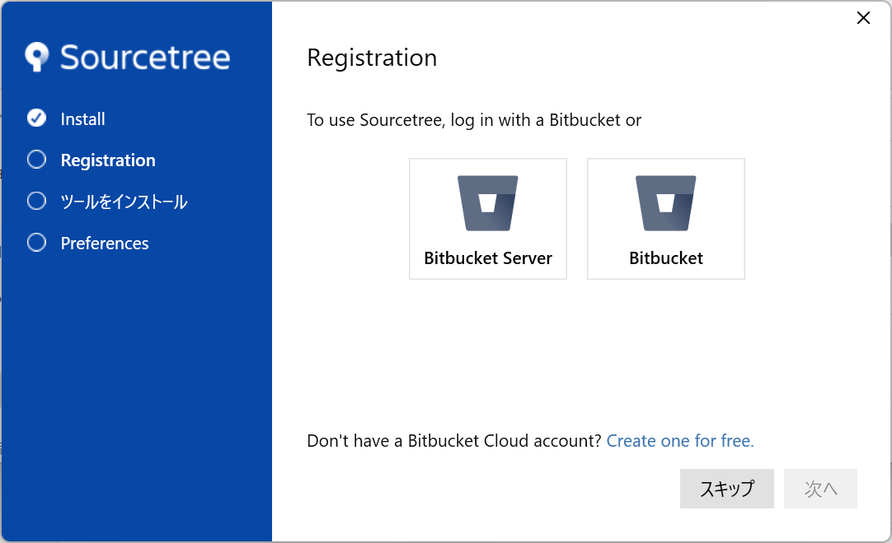
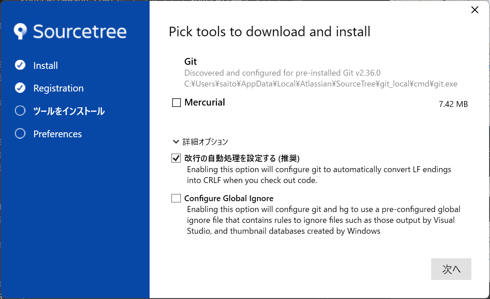
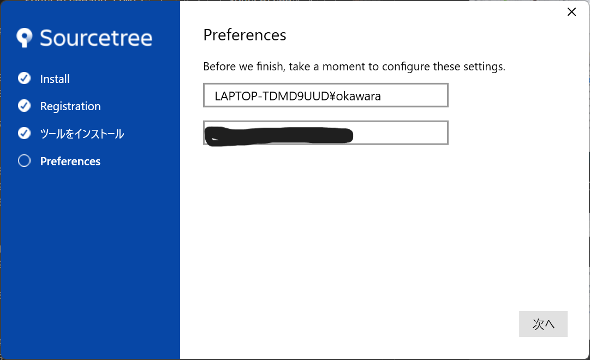
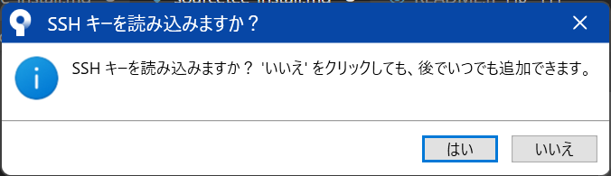

# SourceTreeのインストール

1. [https://www.sourcetreeapp.com/](https://www.sourcetreeapp.com/)にアクセスしてSourcetreeをダウンロードする。
  

1. チェックボックスをチェックしてダウンロード。ダウンロードが完了したらexeファイルを実行。
  

1. スキップをクリック。

1. Mercurialのチェックを外す。詳細オプションの`改行の自動処理を設定する`をチェックして次へをクリック。 
  
 
1. 次へをクリック。
  

1. 一旦いいえをクリック。※後ほど手順作ります。
  

ここまででSouceTreeのインストールは完了です。